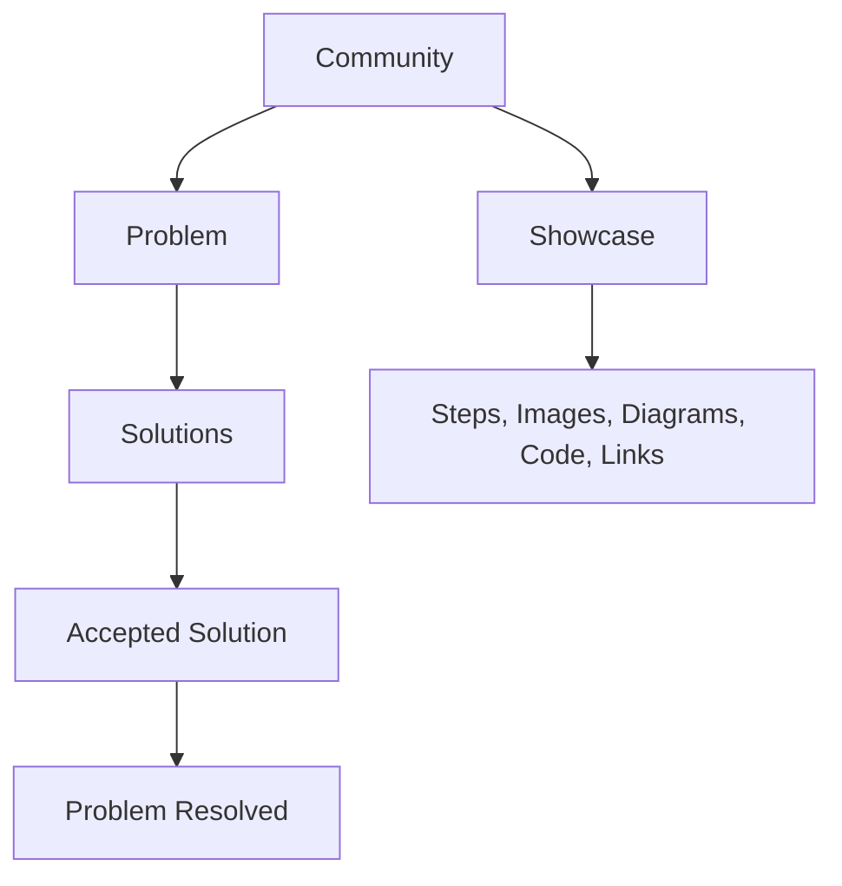

# Community

<a href="https://docs.devsolve.app/en/community/" class="button secondary">English</a>

Community គឺជាតំបន់ចំណេះដឹងបច្ចេកទេសសាធារណៈរបស់ DevSolve។ វាមាន Problems, Solutions ដែលភ្ជាប់នឹង Problems និង Showcases ដាច់ដោយឡែក។

| ជ្រើស | នៅពេលអ្នកចង់ |
| --- | --- |
| **Problem & Bug** | ស្នើជំនួយអំពី Technical Blocker, Bug, Security Question, Deployment ឬ Design Decision |
| **Solution** | ឆ្លើយ Problem ដែលមានស្រាប់ដោយ Fix, Workaround, Explanation ឬ Alternative |
| **Showcase Project** | ពន្យល់ Project, Architecture ឬ Technical Guide ដែលអ្នកបានបង្កើត |

ជ្រើស **Start a discussion** ឬ **Create** ដើម្បីបង្កើត Problem ឬ Showcase។ ដើម្បីសរសេរ Solution ត្រូវបើក Problem ជាមុន។


Community ក្លាយជាសាធារណៈក្រោយ Moderation។ កុំបង្ហោះ Vulnerability ដែលមិនទាន់សម្របសម្រួល Credentials, Personal Data ឬ Secrets។ ប្រើ Private Vulnerability Report សម្រាប់ Asset របស់ Organization។


