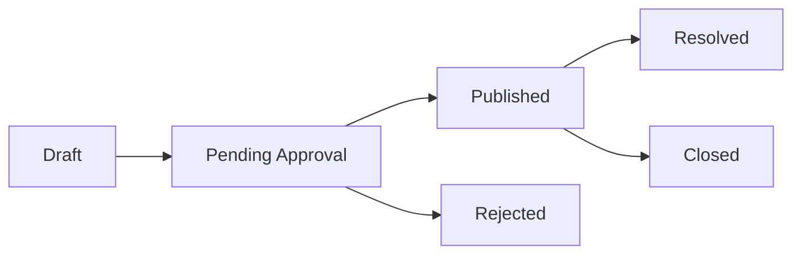

# ការត្រួតពិនិត្យ និងស្ថានភាព Community

<a href="https://docs.devsolve.app/en/community/moderation-and-statuses" class="button secondary">🇬🇧 English</a>

Community Review ការពារគុណភាពមាតិកាសាធារណៈ។ Visibility និង Edit Action អាស្រ័យលើ Content Type, Ownership និង Status។

## Problem lifecycle

| Status | អត្ថន័យ |
| --- | --- |
| Draft | Author បាន Save ប៉ុន្តែមិនទាន់ Submit |
| Pending approval | កំពុងរង់ចាំ Manual ឬ Configured Automated Review |
| Published | Public និងអាចមាន Community Interaction |
| Resolved | មានលទ្ធផលគ្រប់គ្រាន់ ឬ Accepted Solution |
| Closed | Discussion បានបញ្ចប់ |
| Rejected | Moderation មិនអនុម័តឱ្យ Publish |

Solution ប្រើ **Pending**, **Approved**, **Rejected**។ Showcase ប្រើ **Pending**, **Approved**, **Rejected/Changes requested** ហើយ Rejection ត្រូវមាន Reason សម្រាប់ Author។

Administrator អាច Configure AI Auto-Approval ប៉ុន្តែមិនធានាថា Content នឹង Publish ភ្លាមៗទេ។ ចាត់ទុក Pending Content ថាមិនទាន់ Public រហូតដល់ API បញ្ជាក់ Approved/Published។

