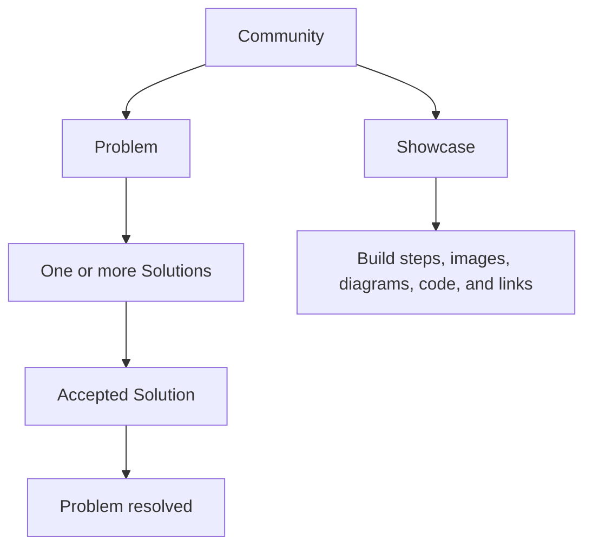

# Community

<a href="https://docs.devsolve.app/km/community/" class="button secondary">ខ្មែរ</a>

Community is DevSolve’s public technical knowledge area. It contains Problems, the Solutions attached to those Problems, and independent Showcases.

## Choose a format

| Choose | When you want to |
| --- | --- |
| **Problem & Bug** | Ask for help with a technical blocker, bug, security question, deployment issue, or design decision |
| **Solution** | Answer an existing Problem with a fix, workaround, explanation, or alternative |
| **Showcase Project** | Explain something you built through a structured project write-up or guide |

Select **Start a discussion** or **Create** from Community to choose between a Problem and Showcase. To write a Solution, open a Problem and choose its answer action.


Community is public after moderation. Do not post uncoordinated vulnerability details, credentials, personal data, or secrets. Use a private Vulnerability Report for an organization’s affected asset.


## Browse Community

Use category tabs, topic filters, search, sorting, and pagination. A Problem can appear as **Open** or **Solved**. Showcases have their own listing and detail pages.

