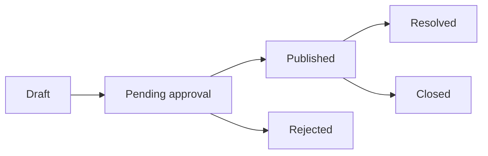

# Community review and statuses

Community review protects the public knowledge base. Visibility and editing actions depend on content type, ownership, and status.

## Problem lifecycle

| Problem status | Meaning |
| --- | --- |
| Draft | Saved by the author and not submitted |
| Pending approval | Submitted and awaiting manual or configured automated review |
| Published | Public and open for Community interaction |
| Resolved | A satisfactory outcome or accepted Solution exists |
| Closed | Discussion ended without remaining open |
| Rejected | Moderation did not approve publication |

## Solution review

Solutions use **Pending**, **Approved**, and **Rejected** review outcomes. An approved Solution can participate normally in the public Problem. A rejected Solution is not treated as a normal public answer and may include information for its author.

## Showcase review

Showcases use **Pending**, **Approved**, and **Rejected/Changes requested**. A rejection reason is required by the current Showcase moderation workflow. Authors can revise eligible Showcases and resubmit them.

## Automated and manual review

Administrators can configure AI auto-approval targets, but the presence of automation does not guarantee immediate publication. Treat pending content as unpublished until the API returns the approved/public state.

