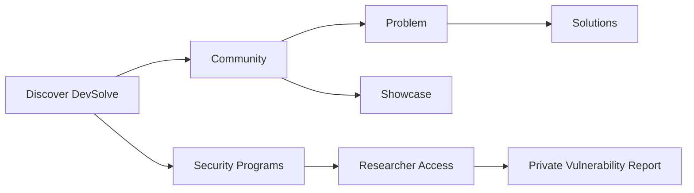

# Getting started

<a href="https://docs.devsolve.app/km/getting-started/" class="button secondary">ខ្មែរ</a>

DevSolve supports security researchers, developers, organization owners and members, and platform administrators.

## How DevSolve works

Public knowledge and private security coordination are separate workflows:

## Account experiences

| Account context | Main capabilities |
| --- | --- |
| Guest | Browse Programs, Problems, Showcases, Hacktivity, Leaderboard, and profiles |
| Individual user | Create Community content, follow users, bookmark content, request reporting access, and submit Reports |
| Organization owner | Manage the organization profile, Programs, team, Researcher Access, Reports, analytics, and incidents |
| Organization member | Use only the organization tools granted by role and permissions |
| Administrator | Verify organizations and Programs, manage users and taxonomy, moderate content, and review incidents |

An individual can also join an organization team. The sidebar shows features according to the active account, organization membership, and granted permissions.

## Next steps

- [Create an account or sign in](accounts-and-sign-in.md)
- [Learn the navigation](navigation.md)
- [Understand Community](../community/README.md)

