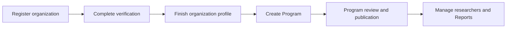

# Organization guide

<a href="https://docs.devsolve.app/km/organizations/" class="button secondary">🇰🇭 ខ្មែរ</a>

The organization workspace covers identity verification, Programs, team access, researcher approval, private Report handling, analytics, and security incidents.

## Typical setup order

The organization owner has owner-only account and roster capabilities. Invited members receive a role plus explicit permissions and see only the matching workspace entries.

## Workspace and team guides

- [Understand the Company Workspace](company-workspace.md)
- [Teams, roles, and permissions](teams-and-permissions.md)
- [Invite members](invite-members.md)
- [Manage the team](manage-team.md)
- [Use My Team and switch workspaces](my-team-and-workspaces.md)
- [Accept organization invitations](../account/invitations.md)

