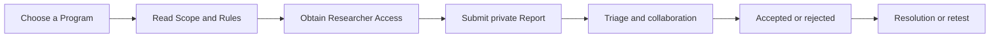

# Researcher guide

<a href="https://docs.devsolve.app/km/researchers/" class="button secondary">ខ្មែរ</a>

The Researcher workspace helps you obtain permission, privately report vulnerabilities, follow decisions, respond to retests, and receive reputation or organization recognition.

## Researcher workflow

## Workspace pages

| Page | Purpose |
| --- | --- |
| **My Access** | Track your reporting permission for each organization |
| **Reports** | Search and open Reports you submitted |
| **Saved Drafts** | Resume incomplete supported content |
| **Rewards** | View the current reward-history interface |
| **Bookmarks** | Return to saved content |


A DevSolve account or Researcher Access does not authorize every test. The selected Program’s current Scope and Rules remain the controlling authorization.


