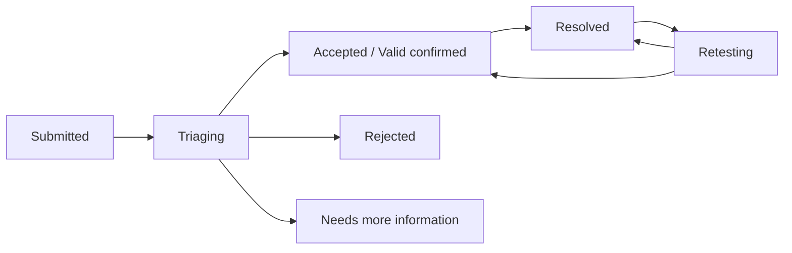

# Report lifecycle and retesting

The researcher interface presents a simplified status while the backend can preserve a more detailed workflow state.

| Displayed state | Meaning |
| --- | --- |
| Submitted | The platform received the Report |
| Triaging | The organization is reviewing it; this can also cover a request for more information |
| Accepted | The finding was confirmed valid |
| Rejected | The Report was closed without acceptance; the underlying reason can include duplicate or other rejection |
| Resolved | The organization recorded the Report as resolved |
| Retesting | The organization asked the researcher to verify the result |

## Respond to a retest

1. Open the Report and its **Retest** area.
2. Read the requested environment, instructions, due date, and any recorded bonus.
3. Re-run only the authorized proof of concept.
4. Attach sanitized evidence if required.
5. Submit either **Verified fixed** or **Still vulnerable** with an accurate explanation.

**Verified fixed** leaves the Report resolved. **Still vulnerable** returns it to a valid-confirmed state for further organization work. A resolved Report can also be reopened by an authorized organization member without waiting for a retest.

