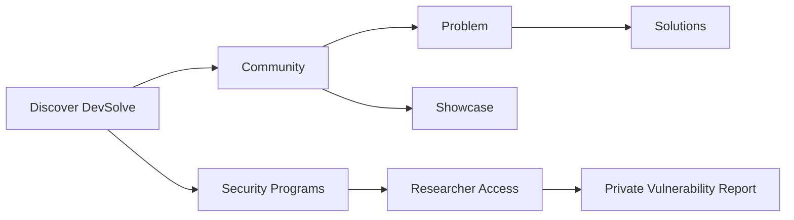

# ចាប់ផ្តើមប្រើប្រាស់

DevSolve គាំទ្រ Security Researcher, Developer, ម្ចាស់ និងសមាជិកអង្គការ ព្រមទាំង Platform Administrator។

## របៀបដែល DevSolve ដំណើរការ

ចំណេះដឹងសាធារណៈ និងការសម្របសម្រួលសុវត្ថិភាពឯកជន គឺជាដំណើរការពីរដាច់ដោយឡែក៖

## បទពិសោធន៍តាមប្រភេទគណនី

| បរិបទគណនី | មុខងារសំខាន់ៗ |
| --- | --- |
| Guest | មើល Programs, Problems, Showcases, Hacktivity, Leaderboard និង Profiles |
| Individual user | បង្កើតមាតិកា Community, Follow, Bookmark, ស្នើសិទ្ធិរាយការណ៍ និងដាក់ Report |
| Organization owner | គ្រប់គ្រង Profile អង្គការ Programs ក្រុម Researcher Access Reports Analytics និង Incidents |
| Organization member | ប្រើតែឧបករណ៍ដែលតួនាទី និងសិទ្ធិបានអនុញ្ញាត |
| Administrator | ផ្ទៀងផ្ទាត់អង្គការ និង Programs គ្រប់គ្រងអ្នកប្រើ Taxonomy មាតិកា និង Incidents |

អ្នកប្រើផ្ទាល់ខ្លួនម្នាក់ក៏អាចចូលជាសមាជិកក្រុមអង្គការបានដែរ។ Sidebar បង្ហាញមុខងារតាមគណនី សមាជិកភាព និងសិទ្ធិដែលបានផ្តល់។

