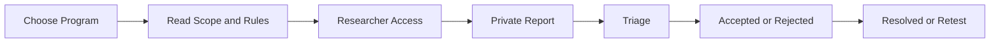

# មគ្គុទ្ទេសក៍ Researcher

<a href="/en/researchers/" class="button secondary">English</a>

Researcher Workspace ជួយអ្នកស្នើសិទ្ធិ រាយការណ៍ភាពងាយរងគ្រោះជាឯកជន តាមដានសេចក្តីសម្រេច ឆ្លើយតប Retest និងទទួល Reputation ឬ Recognition។

| ទំព័រ | គោលបំណង |
| --- | --- |
| **My Access** | តាមដានសិទ្ធិរាយការណ៍សម្រាប់អង្គការនីមួយៗ |
| **Reports** | ស្វែងរក និងបើក Reports ដែលអ្នកបានដាក់ |
| **Saved Drafts** | បន្តមាតិកា ឬ Report ដែលមិនទាន់បញ្ចប់ |
| **Rewards** | មើល Reward History Interface បច្ចុប្បន្ន |
| **Bookmarks** | ត្រឡប់ទៅមាតិកាដែលបានរក្សាទុក |


គណនី DevSolve ឬ Researcher Access មិនអនុញ្ញាត Testing ទាំងអស់ទេ។ Scope និង Rules បច្ចុប្បន្នរបស់ Program គឺជាការអនុញ្ញាតសំខាន់។


