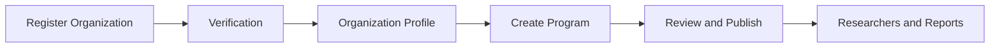

# មគ្គុទ្ទេសក៍សម្រាប់អង្គការ

Organization Workspace គ្រប់គ្រង Identity Verification, Programs, Team Access, Researcher Approval, Private Reports, Analytics និង Security Incidents។

Organization Owner មានមុខងារ Owner-only សម្រាប់ Account និង Team Roster។ Invited Member ទទួល Role និង Explicit Permissions ហើយឃើញតែ Workspace Items ដែលត្រូវគ្នា។

## Workspace និង Team Guides

- [ស្វែងយល់ពី Company Workspace](company-workspace.md)
- [ក្រុម តួនាទី និងសិទ្ធិ](teams-and-permissions.md)
- [អញ្ជើញសមាជិក](invite-members.md)
- [គ្រប់គ្រងក្រុម](manage-team.md)
- [ប្រើ My Team និងប្ដូរ Workspace](my-team-and-workspaces.md)
- [ទទួលយកការអញ្ជើញ](../account/invitations.md)

