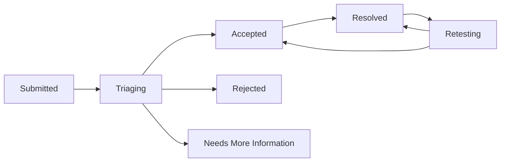

# វដ្តជីវិត Report និង Retest

Researcher Interface បង្ហាញ Status សាមញ្ញ ខណៈ Backend អាចរក្សា Workflow State លម្អិតជាងនេះ។

| Displayed state | អត្ថន័យ |
| --- | --- |
| Submitted | Platform បានទទួល Report |
| Triaging | Organization កំពុង Review; អាចរួមបញ្ចូល Request for More Information |
| Accepted | Finding ត្រូវបានបញ្ជាក់ថាត្រឹមត្រូវ |
| Rejected | Report បិទដោយមិនទទួលយក; មូលហេតុអាចជា Duplicate ឬ Rejection ផ្សេង |
| Resolved | Organization បានកត់ថាបញ្ហាត្រូវបានដោះស្រាយ |
| Retesting | Organization ស្នើ Researcher ឱ្យផ្ទៀងផ្ទាត់លទ្ធផល |

## ឆ្លើយតប Retest

1. បើក Report និងផ្នែក **Retest**។
2. អាន Environment, Instructions, Due Date និង Bonus ដែលបានកត់ បើមាន។
3. ដំណើរការ PoC ដែលបានអនុញ្ញាតឡើងវិញ។
4. បន្ថែម Sanitized Evidence។
5. Submit **Verified fixed** ឬ **Still vulnerable** ជាមួយការពន្យល់ត្រឹមត្រូវ។

**Verified fixed** ទុក Report ជា Resolved។ **Still vulnerable** បញ្ជូនវាត្រឡប់ទៅ Valid Confirmed សម្រាប់ការងារបន្ត។

